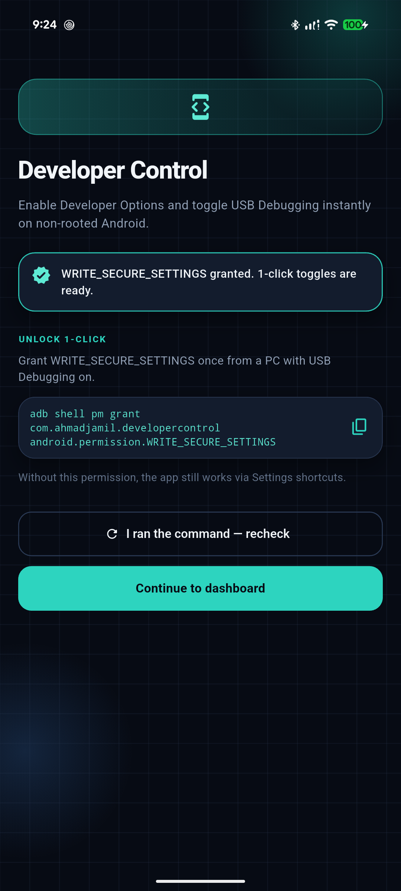
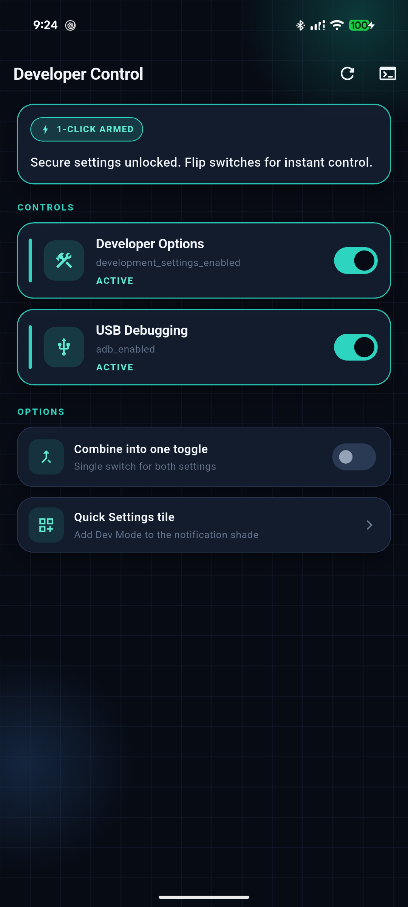

# Developer Control

A Flutter utility for **non-rooted Android** devices that makes enabling **Developer Options** and **USB Debugging** fast and simple — from the app or from the notification shade.

<p align="center">
  
  &nbsp;&nbsp;
  
</p>

<p align="center">
  <em>Left: first-launch setup &nbsp;·&nbsp; Right: dashboard controls</em>
</p>

---

## What this app does

On stock Android, turning developer features on usually means digging through Settings and tapping **Build number** seven times. **Developer Control** shortens that workflow:

| Feature | What you get |
|--------|----------------|
| **Developer Options** | Turn the system developer menu on or off with one switch |
| **USB Debugging** | Toggle `adb` access instantly (when permitted) |
| **Combined mode** | Optional single switch that controls both at once |
| **Quick Settings tile** | Add a **Dev Mode** tile next to Wi‑Fi / Bluetooth |
| **Auto schedule** | Local daily window that turns Dev Mode on/off (manual override still works until the next alarm) |
| **Tap to Lock widget** | Transparent home-screen lock icon — tap to lock instantly (works with the app closed) |
| **Fallback shortcuts** | Without elevated permission, opens the exact Settings pages you need |

---

## Screenshots

### Setup
First launch explains how to unlock seamless 1-click control and shows the one-time ADB grant command.


### Dashboard
Live status for Developer Options and USB Debugging, plus options to combine toggles, add a Quick Settings tile, or enable the Tap to Lock home widget.


---

## How it works

Android does not let normal apps change secure settings without elevated access. This app uses a **two-layer** strategy:

| Mode | When | Behavior |
|------|------|----------|
| **1-click** | `WRITE_SECURE_SETTINGS` granted via ADB | Writes `development_settings_enabled` and `adb_enabled` in `Settings.Global` |
| **Shortcut** | Permission not granted | Opens `Settings.ACTION_DEVICE_INFO_SETTINGS` or `Settings.ACTION_APPLICATION_DEVELOPMENT_SETTINGS` |

The ADB grant is **one-time per install**. Turning Developer Options or USB Debugging off later does **not** revoke it. You need to grant again only after uninstall/reinstall, factory reset, or an explicit revoke.

---

## Requirements

- Android device (**API 24+**)
- Flutter SDK (for building from source)
- USB Debugging already enabled **once** (to run the grant command from a PC)

> Android-only. Secure settings APIs are not available on iOS or desktop.

---

## Getting started

### 1. Clone and run

```bash
git clone <your-repo-url>
cd developercontrol
flutter pub get
flutter run
```

### 2. Grant 1-click permission (recommended)

With the device connected and USB Debugging on:

```bash
adb shell pm grant com.ahmadjamil.developercontrol android.permission.WRITE_SECURE_SETTINGS
```

Then open the app and tap **I ran the command — recheck**, or use the terminal icon on the dashboard to return to setup.

### Revoke (optional)

```bash
adb shell pm revoke com.ahmadjamil.developercontrol android.permission.WRITE_SECURE_SETTINGS
```

---

## Features in detail

- **Onboarding** — Explains the ADB command, copy-to-clipboard, and permission recheck
- **Live toggles** — Real-time ACTIVE / INACTIVE status for each setting
- **Combine into one toggle** — Control both settings with a single switch
- **Quick Settings tile (“Dev Mode”)** — Toggle both from the notification shade  
  - Android 13+: use **Quick Settings tile** in the app to prompt adding it  
  - Older Android: swipe down → edit tiles → add **Dev Mode**
- **Auto schedule** — Local daily on/off window for Developer Options + USB Debugging:
  1. Flip **Auto schedule** ON (needs ADB `WRITE_SECURE_SETTINGS` grant)  
  2. Set **Turn on at** / **Turn off at** (overnight windows like 22:00 → 08:00 work)  
  3. Alarms run on-device via `AlarmManager` — no cloud  
  4. You can still flip Dev Mode anytime from the app or Quick Settings tile; your choice sticks until the **next** scheduled on/off  
  5. Survives reboot (alarms are re-armed on boot)
- **Tap to Lock home widget** — One dashboard switch to set everything up:
  1. Flip **Tap to Lock widget** ON  
  2. Tap **Activate** on the Device Admin screen  
  3. Confirm the system prompt to place the transparent lock icon on your home screen  
  4. Tap the grey lock icon anytime to lock the phone — even when the app is killed  
  - Uses `DevicePolicyManager.lockNow()` from a native `AppWidgetProvider` (no Flutter UI launched)  
  - If your launcher does not support pin prompts: long-press home → Widgets → **Tap to Lock**
- **Provider architecture** — Controllers for app/bootstrap, developer settings, and lock widget

---

## Project structure

```
lib/
  main.dart
  app.dart                              # MultiProvider + routing
  controllers/
    app_controller.dart                 # Onboarding / navigation
    developer_settings_controller.dart  # Toggles & preferences
    lock_widget_controller.dart         # Tap to Lock toggle flow
  core/
    constants/
    theme/
    widgets/                            # Glass UI building blocks
  data/
    models/
    services/                           # MethodChannel + SharedPreferences
  features/
    onboarding/
    dashboard/
android/.../MainActivity.kt               # Settings.Global + QS tile + Tap to Lock + schedule bridge
android/.../DeveloperModeTileService.kt   # Quick Settings tile
android/.../DevModeScheduleHelper.kt      # Local AlarmManager on/off window
android/.../DevModeScheduleReceiver.kt    # Schedule + boot alarms
android/.../LockHelper.kt                 # Device Admin + pin widget helpers
android/.../LockScreenWidgetProvider.kt   # Home widget → lock (no Flutter)
android/.../LockDeviceAdminReceiver.kt    # Device Admin for lockNow()
assets/screenshots/                       # README screenshots
```

---

## Tech stack

- **Flutter** + **Dart**
- **Provider** for state management
- **shared_preferences** for onboarding / UI prefs
- **Kotlin** platform channel for `Settings.Global`, Quick Settings, and Tap to Lock
- **Device Admin** (`force-lock`) for locking from the home widget

---

## Build release APK

```bash
flutter build apk --release
```

Output:

```text
build/app/outputs/flutter-apk/app-release.apk
```

---

## Privacy & safety

- The app only reads/writes the developer-related secure settings it needs
- `WRITE_SECURE_SETTINGS` is a protected permission — grant it only to apps you trust
- **Tap to Lock** uses Device Admin only to call `lockNow()` — it does not wipe data or change other device policies
- No Accessibility overlay / floating button
- No root required
- Not intended for Google Play distribution while relying on privileged permissions (sideload / self-use)

---

## License

Private / personal project (`publish_to: 'none'`). Add a license file if you plan to open-source it.
